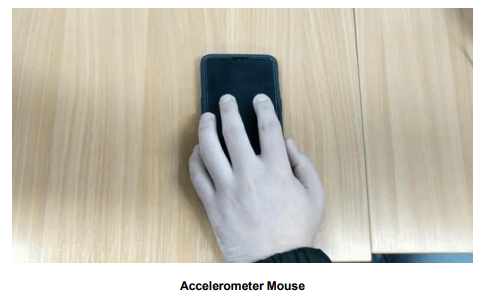
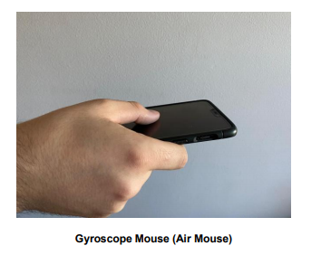

# SmartMouse
This application was made for my undergraduate project, where I created an Android application called SmartMouse that allows you
to interact with your computer by using your smartphone remotely

## To Use
1. Install SmartMouse on an Android application (which can be done via Android Studio)

    a. To install the application, enable USB Debugging on the Android device and set Default USB Configuration to File Transfer
    
    b. Plug in the Android device via cable into the computer
    
    c. Install by using Android Studio
    
2. Run the server application (found here https://github.com/bnaze/ug_project_server)
3. Use the application to connect to the server. Ensure that the smartphone and computer/laptop is connected to WiFi

    a. Use the IP address starting 192.168.x.x
    
    b. The IP address should be given to you when executing the server code (in console)
    
# What can I do with this?
The application implements three different type of mice; air, touchpad and accelerometer mouse
To use the air mouse, you rotate the phone
You can use the touchscreen as a touch pad
To use the accelerometer mouse, place the phone on a flat surface and use it like an optical mouse

# Introduction to the project
Computers are accessed and navigated through the classic forms of a keyboard and
mouse. In an ever-mobilising world with an increasing demand for on-the-go solutions to
the use of computers and systems, sensors can be utilised in creating added use to
existing technological devices held by most. SmartMouse is an Android application that
has been developed to allow users to interact with their computers using their
smartphone. The following piece of work seeks to create an application which utilises
smartphones to navigate and interact with computers. To achieve this, three sensors
which already exist in smartphones were explored; the gyroscope, accelerometer and
touchscreen. The thorough researching of smartphone hardware Android mobile
development, digital signal processing, mouse hardware, socket programming and a
review on physics and mathematical integration for position tracking were all required to
finalise the end-products of the application. Below are brief definitions of the types of
mice which were implemented as part of this project.
The first type of mouse that I implemented was an accelerometer mouse which allows
the smartphone to mimic an optical mouse. The accelerometer returns the acceleration
that the phone is travelling at by using acceleration values. I explored ways to calculate
distance by numerically integrating values to return distance travelled. 

The second type of mouse is an air mouse. This allows the users to hold the phone in
their hand and move the cursor on the computer by rotating the smartphone. The
gyroscope returns the change of rotation of the smartphone, which can be used to map
to pixels and cursor movements. 

Lastly, the third type of mouse is touchscreen. This allows users to use the smartphone
similarly to a touchpad on a laptop. Their finger and gestures will be detected on the
smartphone, and the position of their finger is returned. As they move their finger along
the touchscreen, the position is continuously returned and similarly to the gyroscope, the
change of the finger’s position can be used to map to pixels. This mouse is similar to the
touchpad mice found in laptops.

Two executable applications for the mobile and computer have been created as an endproduct to this project. The mobile application is the client application that will send
position tracking and keyboard input information to the computer, which acts as the
server. The computer application would move the cursor and enable keyboard input
using the information sent by the mobile.
It was found that the gyroscope and touchscreen sensors are successful in interacting
computers and mimicking functionalities of a typical mouse and keyboard. However, the
attempt to replicate the optical mouse using the accelerator sensor proved to be difficult. 
The research and testing outlined below will detail further the process and challenges
faced in coming to the end-products under the project in question. 

# Problem Statement
There are situations where users want to interact with their laptop/computers, only to be
too far from their keyboard and mouse. Some examples can be in presentations or home
theatre systems where computers are used and require a ‘remote’ similarly to a TV or
smartboard. The main advantages of having a PC is a larger screen and faster
performance, but users are restricted to using the PC by sitting in front of it.
There are situations where users are required to use an optical mouse in order to interact
with their computers. SmartMouse provides an alternative to replace the function of the
mouse with a smartphone. Therefore, becoming a quick go-to application in
circumstances where users may be travelling lightly or presenting. SmartMouse also
provides an answer to the limitations of distance present in existing models of humancomputer interaction. Each type of mice implemented has the potential to pose a unique
use case. The application is developed in Java, which further improves the crosscompatibility regarding with computers, so this can be beneficial for those using Linux.
## Scenarios
The gyroscope mouse can appeal to teachers who want to create a more interactive
class for their students. Being able to control the keyboard and mouse from a distance
can create a more interactive educational environment. Students could possibly connect
their smartphone to the teacher’s computer and interact with the presentation slides.
There are of course other considerations to have had such as security breaches which
means that the setting up of such interactions require careful set up and handling by the
teacher/host.
The touchscreen can be used by those who have a computer as part of their home
theatre. Typically, these users will have to use a keyboard and mouse that are wireless,
but with this application, they can use their smartphone as their remote. 

# Aim
The aim of this project is to release an application that implements three types of mice:
accelerometer (optical-like), gyroscope (air mouse) and touchscreen pad. The aim is also
to implement a keyboard functionality on the application triggering keyboard-like
characters on a given computer device.
This project has been supported by the creation of two applications, both of which have
been written in Java. The client application on the smartphone has been created using
Android’s SDK and Android Studio. The application is a standard Java program which
when executed will create servers for the client to be able to connect to. 

# Objectives
The overall objectives of this application are summarised below:

• Implement three different type of mice for an Android smartphone;

    o accelerometer (optical-like)
    
    o gyroscope (air mouse)
    
    o touchscreen (touchpad)
    
• Enable keyboard input from the smartphone into the computer

• Usable and Optimised GUI to showcase all three types of mouse and keyboard

# Conclusion (What I learned)
The SmartMouse project has showcased valuable lessons learned. Firstly, this project
has exhibited the physical limitations that are at stake when trying to utilise the
accelerometer sensors in smartphones to mimic an optical mouse. This finding is
significant as when added to the existing applications available in the market, the theory
and testing behind SmartMouse, provides another steppingstone to look for alternative
technologies and approaches to create optical mouse mimicking. On the other hand, the
gyroscope sensor has proven to be an incredibly effective sensor to use in userinterfaces. I found this to be an important takeaway from this project as it holds the power
to be applied to many more interesting forms of use cases which can in turn optimise
user experiences.
On a personal level, SmartMouse has increased my familiarity with Android mobile
development and coding software. The project has provided me with the space to apply
learning retrieved from Software Engineering and Internet Protocols and Applications
modules whereby, the theory was applied to real-world contexts. I used many concepts
and design patterns and object-oriented modelling from my existing software engineering
knowledge in my design phase where I applied the Singleton design patterns and created
class diagrams. Building and using these experiences I was able to create a
sophisticated server for SmartMouse.
Overall, I am pleased with the outcome of SmartMouse as it has proven to be an effective
application fulfilling its main objectives and taking lessons learned from the challenges it
has faced. I am confident that the nuances of the application design will be applicable to
various other forms of user-interfaces such as applications of drawing and gaming,
therefore, proving a humble contribution to existing interaction design. 

# Recommendations
I would highly recommend reviewing the feasibility of having a smartphone replace an
optical mouse. SmartMouse approaches this task by utilising the accelerometer sensor.
As seen in the evaluation and testing stages, the accelerometer has difficulties in
calculating the precise position of the smartphone. Without precise position, a usable
mouse is impossible to have. I would recommend avoiding working with linear
acceleration to find displacement as the accelerometer is too noisy to be usable.
However, combing other sensors such as the gyroscope with accelerometer for linear
movement can be explored to create precise positioning with the smartphone. Perhaps
attaching a small optical sensor and creating a product for the smartphone to mimic an
optical mouse.
